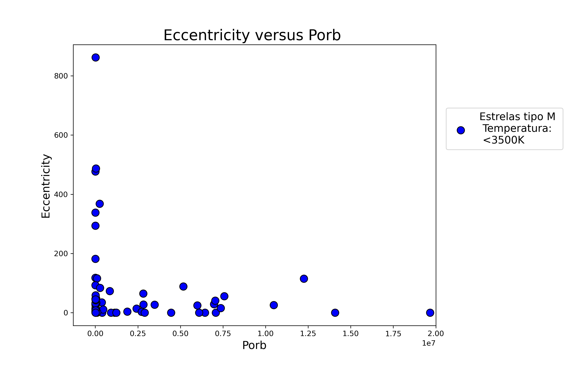

# eccentricity vs orbital period
code to illustrate on a graph the connection between the eccentricity and the orbital period of a star

## author
Rafaelly Rodrigues 
- @moonrafa 
- an example used in my scientific initiation at the Nucleo de Astronomia Observacional e Instrumental (NAOS) at the Federal University of Rio Grande do Norte (UFRN)

## Output

